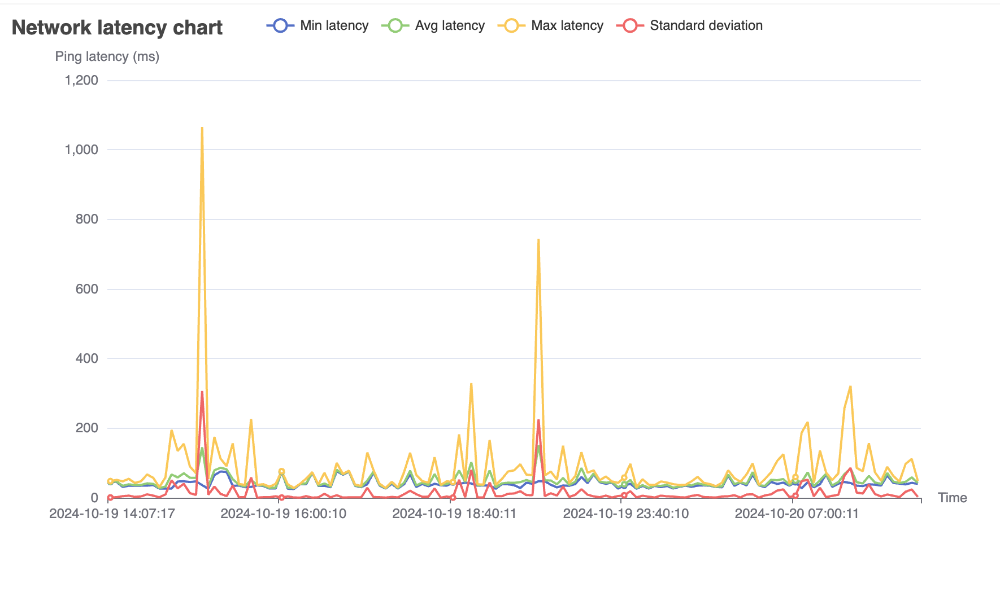

# Network Latency Visualizer

## Features

1. **Data Visualization**: Visualize network latency data over time in easy-to-understand charts.
2. **Network Latency Monitoring**: Perform regular network latency checks using the `ping` command. You can set the frequency of checks (from every 5 minutes to once a day) via a cron job to automate the process.
3. **Process Bandwidth Usage**: Track bandwidth usage by individual processes, displaying both incoming and outgoing data.
4. **Download & Upload Speed**: Measure and display your current download and upload speeds.

Please notice this program **ONLY** runs on macOS.

## How to Use

1. Make the script executable:

   ```bash
   chmod 777 scanning
   ```

2. Start data collection:

   ```bash
   ./scanning
   ```

3. For advanced options, run:
   ```bash
   ./scanning -a
   ```

### Advanced Options Menu

Upon running the advanced options, you'll see the following menu:

A terminal option screen will appear with various option, pick what you like!

```
What do you want to do?:
>  Cronjob options
   Show network bandwidth consumed by top 3 processes
   Show network latency chart
   Speed testing
   Quit
```

#### Options Explained

- **Cronjob Options**: Modify or remove the existing cronjob that automates network checks. You can view the current cronjob by using:
  ```bash
  crontab -l
  ```
  The cronjob working directory will resemble: `$Yourworkingdir/go-networking/scanning`.
- **Show Network Bandwidth by Top 3 Processes**: Displays two HTML graphs in your browser:

  1. Incoming network bandwidth usage by the top 3 processes.
     
  2. Outgoing network bandwidth usage by the top 3 processes.
     

  Additionally, a detailed table with all processes and their bandwidth usage will be displayed in the terminal.

- **Show Network Latency Chart**: Opens an HTML graph with a full network latency performance overview.
  

All HTML charts are stored in the `chart/html` folder for future access.

### Data Storage

- **Network Bandwidth Data**: Stored in `network/network.txt`.
- **Network Latency Data**: Stored in `ping/ping.txt`.

## Motives

This project was created as a way to get familiar with the Go programming language, combined with an interest in networking.

## Technology

- **Latency Data Collection**: Uses the built-in macOS `ping` command (`ping google.com -c 10`) to gather latency data.
- **Bandwidth Usage**: Uses `nettop -l 1 -P -x` to monitor bandwidth usage by each process.

## Project Structure

This project is organized into several folders, each responsible for specific functionalities related to network monitoring, data tracking, and visualizations.
```bash
.
├── README.md
├── chart
│   ├── chart.go
│   └── html
│       ├── networkpid-in.html
│       ├── networkpid-out.html
│       ├── ping.html
│       └── speedtest.html
├── cronjob
│   ├── cron.txt
│   └── cronjob.go
├── go.mod
├── go.sum
├── img
│   ├── incoming-network-data.png
│   ├── network-latency-chart.png
│   └── outgoing-network-data.png
├── main.go
├── network
│   ├── network.go
│   └── network.txt
├── ping
│   ├── ping.go
│   └── ping.txt
├── scanning
├── speedtest
│   ├── speedtest.txt
│   └── speedtesting.go
├── table
│   └── table.go
└── terminal.go
```


## Folders Overview

### 1. `chart/`
- **Description:** Contains all the code for creating charts, which are rendered as HTML files.
- **Files:**
  - `chart.go`: Handles the creation of all charts.
  - `html/`: Subfolder where the generated HTML charts are stored.

### 2. `cronjob/`
- **Description:** Manages cron jobs for scheduling tasks. This includes the creation, deletion, and editing of cron jobs.
- **Files:**
  - `cronjob.go`: Code for setting up, deleting, and editing cron jobs.
  - `cron.txt`: Text file for setting up cronjob.

### 3. `network/`
- **Description:** Records and reads network data, preparing the necessary data for the process network usage chart.
- **Files:**
  - `network.go`: Handles the recording and reading of network usage data.
  - `network.txt`: Store all the data used for process network usage chart.

### 4. `ping/`
- **Description:** Tracks network latency by recording and reading ping data, preparing for the network latency chart.
- **Files:**
  - `ping.go`: Code responsible for managing ping data for latency charts.
  - `ping.txt`: Store all the data used for network latency chart.

### 5. `speedtest/`
- **Description:** Manages speed tests by recording and reading speed test data, which will be used in the speedtest chart. This chart appears when the process network usage chart is opened.
- **Files:**
  - `speedtest.go`: Handles speed test data tracking and preparation for the chart.
  - `speedtest.txt`: Store all the data used for speedtest chart.

### 6. `main.go`
- **Description:** The entry point of the program, responsible for initializing the entire application.


## Limitations

- **Latency Measurement**: The `ping` command only measures the total round-trip latency, so it cannot distinguish whether upload or download is slower.
- **Process Name Length**: The `nettop` command truncates long process names, but it's usually clear enough to identify the associated application.
